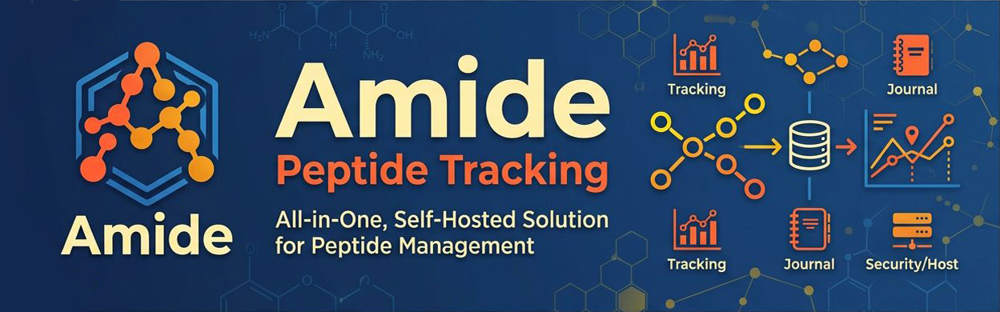

<p align="center"></p>

# amide
Amide is a self-hosted Peptide Tracking System that brings together tracking, scheduling, and research in one place.

Amide is the name of the chemical bond that holds a peptide together, which is much like the goal of this project. Every peptide is a chain of amino acids, and each link in that chain is an amide bond. That "bond" idea maps onto what this app does: it links vials, doses, schedules, and logs into one chain of records, allowing you to see where you started, where you are now, as well as finding what works and what did not. At the same time, keeping YOUR health data in YOUR hands, without being held hostage by yet another subscription service

Amide's goal is a self-hosted method of tracking:

- Quick View Dashboard
- Inventory
- Order Tracking
- Personal Distributor Contacts
- Protocols
- Titration Schedules
- Daily Dosing
- Macro Tracking including Water, Protein, & Fiber
- Reconstitution Calculator
- Peptide Pen Tracking
- Weight & Measurement Tracking
- Labs & Medical Results
- Exercise Plan Building & Tracking
- Journal
- Peptide Library
- Peptide Learning
- Health Tracker Integrations (Hume, Apple, etc)

While all of these features may not be active yet, this is the goal.  The system that bonds you & your peptide use together, for long term success.

Amide: every dose, linked.

----------------------------------------------------------------------------------------------------
LEGAL NOTICE

No information herein constitutes a medical prescription, personal use recommendation, or substitution for professional health guidance.
The doses, cycles, and protocols described reflect ranges used primarily in the U.S. in research and integrative medicine contexts. 

Regulatory status varies by country.

Always remember: Consult a doctor before using any substance. Responsible use begins with information and adequate professional guidance.
----------------------------------------------------------------------------------------------------


## Status

**v1.0.** Everything in the goal list above exists in some form except Peptide Learning and the health-tracker integrations. In one place:

- **Dashboard:** today's schedule, alerts, compliance bars (Protocol, H2O, Diet, Workout) over a window you choose, workouts this week, water goal, cost snapshot, weight, body diagram, journal quick note, items in shipment.
- **Inventory and orders:** stock with COAs, expiration and storage; orders with tracking numbers and status like a parcel; low-stock and expiry alerts; supplies (syringes, pads, BAC water ranked by your priority).
- **Protocols and dosing:** goal-driven builder, titration, cycles on and off, specific days, a Today view with injection-site picker, calendar, catch-up for missed doses, and a **Shop this protocol** plan that finds the cheapest one- or two-order purchase from the price lists (text file or email to share it).
- **Reconstitution:** calculator with IU support and a teaching mode; Active Vials with discard dates; peptide pens.
- **Vendors and price lists:** contacts, payment methods, price history charts, price lists read from PDF, photo (OCR) and spreadsheet, and an optional Telegram watcher that files lists you follow for review ([watcher/README.md](watcher/README.md)).
- **Body and health:** weight and measurements, body photos (blurred until you reveal them), journal, labs, food and macros, workouts with calorie estimates and a fitness test.
- **Library:** 106 base peptide cards come with the app (aliases, tags, dosing tiers, cycles, stack notes, monitoring and plain-language sections), plus your own notes and entries.
- **You and your data:** accounts with optional two-factor, opt-in sharing, encrypted backup, export and restore. Self-hosted: nothing leaves your machine unless you turn an integration on.

How to use it: [docs/USER_GUIDE.md](docs/USER_GUIDE.md). What came when: [CHANGELOG.md](CHANGELOG.md). What is next: [docs/ROADMAP.md](docs/ROADMAP.md). Running it for real (HTTPS, backups, updates): [docs/DEPLOYING.md](docs/DEPLOYING.md).

## Running Amide

All of your data (the SQLite database and uploaded COAs) lives in one folder, `data/`. Back up that folder and you've backed up everything.

### With Docker (recommended for self-hosting)

```bash
docker compose up -d --build
```

Then open http://localhost:1707 (or `http://<server-ip>:1707` from another device).

To use a different port, copy `.env.example` to `.env` and change `AMIDE_PORT`, then run `docker compose up -d` again.

### With Portainer, or the ready-made image

No download or build needed: [docker-compose.portainer.yml](docker-compose.portainer.yml) runs the published image (`ghcr.io/xsatc77/amide`). In Portainer choose **Stacks, Add stack, Web editor**, paste the file and press **Deploy the stack**, then open `http://<your server>:1707`. With plain Docker, save it as `docker-compose.yml` and run `docker compose up -d`. Your data lives in a named volume, `amide-data`. To update, press **Pull and redeploy** on the stack with **Re-pull image** on.

**Optional Telegram watcher:** its own container, with a stack file that adds it next to Amide: [docker-compose.portainer-with-watcher.yml](docker-compose.portainer-with-watcher.yml). Steps in [watcher/README.md](watcher/README.md).

### Without Docker (for development)

Requires Python 3.12+. Run each line one at a time.

**Windows (PowerShell):**

```powershell
py -m venv .venv
.venv\Scripts\pip install -r requirements-dev.txt
.venv\Scripts\python -m app --reload
```

**macOS / Linux:**

```bash
python3 -m venv .venv
.venv/bin/pip install -r requirements-dev.txt
.venv/bin/python -m app --reload
```

Then open http://localhost:1707. Press Ctrl+C to stop. Run the tests with `.venv\Scripts\pytest` (Windows) or `.venv/bin/pytest`.

Database migrations are applied automatically on startup.

### Importing your peptide cards

Your card PDF is imported once with a helper script (it needs one extra library, PyMuPDF, which the app itself doesn't use):

```bash
pip install -r tools/requirements.txt
python tools/import_cards.py "path/to/Peptide Cards.pdf"
```

Card text and images are saved in `data/library/` (private, never committed). To load them into another database later, no PDF needed: `python -m app.library_load`. Details: [tools/README.md](tools/README.md).

### Settings (environment variables)

| Variable | Default | Purpose |
| --- | --- | --- |
| `AMIDE_PORT` | `1707` | Port Amide is reachable on |
| `AMIDE_HOST` | `127.0.0.1` | Address to listen on when run without Docker (`0.0.0.0` = reachable from other devices) |
| `AMIDE_DATA_DIR` | `./data` (`/data` in Docker) | Where the database and uploads are stored |
| `AMIDE_DATABASE_URL` | `sqlite:///<data dir>/amide.db` | Override to use another database |
| `AMIDE_MAX_UPLOAD_MB` | `15` | Max COA upload size |
| `AMIDE_PASSWORD_MIN_LENGTH` | `8` | Minimum password length |
| `AMIDE_NTFY_SERVER` | `https://ntfy.sh` | Where dose reminders are posted, for users who turn them on (use your own ntfy server if you run one) |
| `AMIDE_REMINDERS` | `1` | Set to `0` to switch the reminder loop off entirely |
| `AMIDE_BACKUP_PASSPHRASE` | (none) | Set it (8+ characters) and Amide writes an encrypted whole-installation backup to `data/backups` every `AMIDE_BACKUP_DAYS` days (default 7), keeping the newest `AMIDE_BACKUP_KEEP` (default 4) |
| `AMIDE_LINK_DESCRIPTIONS` | `1` | On the Links page, a link saved without a description is fetched once to read a short description from the site. `0` turns this off and nothing is fetched |
| `AMIDE_USDA_API_KEY` | (none) | A free [FoodData Central](https://fdc.nal.usda.gov/api-key-signup.html) key (or each person can paste their own in Settings, USDA food search) turns on **Search the USDA database** in the Add food dialog; without it nothing is ever sent |

### Accounts

- **First run:** accept the legal notice, choose **New User**. The first account is the admin and takes over any data created before accounts existed.
- **Privacy:** each account sees only its own inventory and protocols. The peptide library is shared.
- **Passwords:** case sensitive, at least `AMIDE_PASSWORD_MIN_LENGTH` characters with an uppercase, lowercase, number and special character. Usernames are not case sensitive.
- **Two-factor (optional):** any authenticator app (Google/Microsoft Authenticator, Authy, 1Password, Bitwarden…). Turn it on at sign-up or from the menu under your initial (top right).
- **Timeout:** with no Amide tab open for 10 minutes you're signed out; the next visit shows the legal notice again.
- **Lockout:** 5 wrong passwords or codes lock that account for 15 minutes.
- **Recovery** (there's no email), run on the server:

  ```bash
  python -m app.users list
  python -m app.users reset-password <username>
  python -m app.users reset-2fa <username>
  ```

  (In Docker: `docker compose exec amide python -m app.users list`.)
- **Banner:** put your own image at `data/branding/banner.svg` (or `.png`, `.jpg`, `.webp`) and it replaces the built-in one on the sign-in screens.

> Logins over plain `http://` are fine on your home network. To reach Amide over the internet, put it behind HTTPS (a reverse proxy) or a VPN: see [docs/DEPLOYING.md](docs/DEPLOYING.md).

## Tech stack

Python · [FastAPI](https://fastapi.tiangolo.com/) · [SQLAlchemy](https://www.sqlalchemy.org/) + [Alembic](https://alembic.sqlalchemy.org/) migrations · SQLite · server-rendered Jinja templates with a little vanilla JS · Docker.

## Project layout

```
app/
  __main__.py        `python -m app` launcher
  main.py            app entry point
  models.py          database tables
  routers/           pages + JSON API, one file per feature
  library/           card loader + library form rules
  protocols/         protocol status + builder form rules
  templates/         HTML
  static/            CSS / JS
migrations/          Alembic database migrations
tests/               pytest suite
tools/               one-off helpers (card PDF import)
docs/ROADMAP.md      where this is going
```

--------------------------------------------------------------------------------------------------------------------------------------------------------------------


