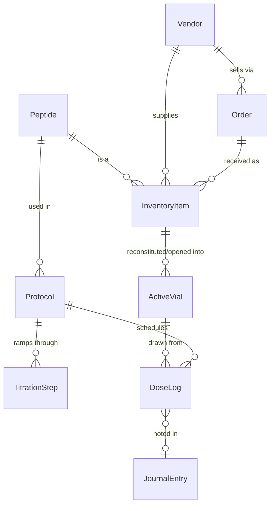

# Amide Roadmap

Where Amide is today, and the path from here to the full feature list in the README.

Each phase is a usable release on its own. Phases are ordered by **data dependency**: later features read records created by earlier ones, so we build the chain from the bottom up — *stock → vials → protocols → doses → everything that analyzes doses*.

---

## Where we are: v0.7 — Inventory + Protocols + Library + Daily Dosing + Dashboard + Vendor Management + Body & Health Tracking (Weight & Measurements + Journal + Labs) ✅

**Vendor Management (v0.6, shipped ahead of schedule)**
- A full `/vendors` page: structured contact/payment methods (built-in types get clickable links,
  custom types are user-addable and reusable), recommend/don't-recommend, per-user favorites,
  sortable list, a price-list attachment with a staleness prompt on reorder, and Purchase History
  scoped the same way every other page in this app is (your own data, plus anyone who's shared
  Inventory with you)
- The New Order flow now asks "new vendor or existing?" up front, and prefills each line's price
  from your own last order with that vendor for the same item — derived from existing order
  history, no separate price list to maintain

**Daily Dosing (v0.4)**
- **Today view** (`/today`): every dose due today, Log (draws the oldest-open Active Vial, deducts the volume, records time) or Skip, with a body-silhouette **injection-site picker** that highlights the last-used site and pulses the recommended mirrored side
- **Missed/late handling:** a day only counts as missed once it's fully passed; a "catch up" list of recent missed doses lives on the Protocol page and logs them as Late
- **Adherence history:** color-coded dots on the Calendar (month/week/day) and a full dose-history table on the Protocol page
- **Peptide pens:** no separate entity — an Active Vial gains a `dispensing_method` flag, set at reconstitution or converted later, with dose-logging wording adjusted accordingly

**Library (v0.3)**
- All 100 peptide cards imported (text + card image) into a searchable Library with goal / "added by me" filters
- Per peptide: your Low/Mid/High dose, frequency, aliases, notes, and goal-stack membership (editable)
- Protocol builder: type-ahead search over the whole library; "View card" per peptide
- `tools/import_cards.py` to re-import an updated PDF; `python -m app.library_load` to reload without it

**Protocols (v0.2)**
- Protocols page: **Active** protocol cards (yellow ribbon), 8 selectable **goal cards**, and **Saved protocols** (scheduled / paused / ended — kept until deleted, with Repeat)
- Goal-driven **builder**: goals → suggested peptide stack (merged across goals) → your dose, unit (mg / mcg / IU), frequency, time of day, route and optional inventory link per peptide
- **Titration** checkbox with weekly steps per peptide; cards show the current step
- Pause / Resume / End / Repeat / Delete; Share button in place (email sharing later)
- Peptide library seeded with the 100 peptide-card names + 5 starters; goal stacks seeded (doses blank for now)
- Read-only JSON API: `/api/protocols`, `/api/peptides`

**Inventory (v0.1)**

- Inventory table: name, count, vial size (mg), medium, lot/batch #, cost, vendor, order / shipped / arrival dates, COA upload (photo/PDF) with lab-measured vial size and purity, notes
- Flags items whose lab-measured amount is more than 10% below the labeled vial size
- **+ Add item** form, edit, delete, COA viewer
- Read-only JSON API (`/api/inventory`) for upcoming features to build on
- SQLite database with migrations, Docker deployment, automated tests

---

## The target data model

This is where the chain is headed. `InventoryItem`, `Peptide`, `Protocol` (with items) and `TitrationStep` exist today.

Key idea: **InventoryItem** is *sealed stock on the shelf* (count = 5 vials). When you reconstitute or open one, it becomes an **ActiveVial** with its own concentration, open date, and remaining amount. Doses are drawn from active vials, which is how Amide will know how much is left and when to reorder.

---

## Phase 1 — v0.2: Inventory foundations

Firm up the base before anything depends on it.

- ✅ *Medium-aware form shipped in v0.7*: amount + unit (mg/mcg/IU), volume for Liquid, units-per-package for Autoinjector/Pill, required fields enforced per medium.
- ✅ *More stock details shipped in v0.7*: expiration date, storage (fridge / freezer / room temp).
- ✅ *Vendors as their own table shipped in v0.7*, as a pick-or-create field on the inventory form (like the peptide picker). A full standalone Vendors management page — edit a vendor's website/contact info, see everything ordered from them — is still Phase 5's *Personal Distributor Contacts*.
- ✅ *Search, sort, filter on the inventory list shipped in v0.7.*
- ✅ *Accounts, legal notice, private data per user and 2FA shipped in v0.4.*
- ✅ *Backup/export (JSON + CSV, additive-only import) shipped in v0.7.*
- ✅ *Settings page shipped in v0.8*: username/password/2FA, email, timezone, colorway, and an admin Manage Users panel, reached from the account menu; Backup & restore now lives there too.
- ✅ *Sharing shipped in v0.9*: per-person, opt-in read-only sharing of Inventory and Personal Data (Protocols), managed from Settings.

## Phase 2 — v0.3: Reconstitution Calculator + Active Vials

- ✅ *Calculator shipped in v0.6*: concentration, draw volume, U-100 units, syringe-fill visual, presets, reverse target-units solver, Inventory/Protocol prefill.
- ✅ *Active Vials shipped in v1.0*: reconstitute from Inventory or the Calculator, tracked concentration/discard-by/doses, expiry-aware Active Vials section with the real vial icon, default discard-window setting.
- **Still open — remaining icon art:** the Calculator's own syringe-fill visual still uses its original CSS-drawn look; the other cropped icons (pens, pill bottle, etc.) remain unused until later phases need them.

- **Calculator:** vial mg + bacteriostatic water mL + desired dose → concentration, **units to draw on a U-100 syringe**, and doses per vial. Syringe size picker (0.3 / 0.5 / 1 mL) with a visual fill line.
- Works standalone, *or* pre-filled by picking an inventory item.
- **"Reconstitute" action:** takes 1 from inventory count → creates an Active Vial with concentration, date mixed, and a discard-by date (configurable, e.g. 28 days).
- Active vial list: remaining mg / doses, days until discard.

## Phase 3 — v0.4: Daily Dosing *(the core loop)* ✅

- ✅ *Protocols and titration steps shipped in v0.2.* Still to add: cycles like 5 on / 2 off, and **titration templates** (common schedules pre-filled when Titration is ticked).
- ✅ *Today view shipped in v0.4*: doses due today, tap to log → picks the oldest-open active vial, deducts the drawn amount, records time and **injection site** (with mirrored-side rotation suggestions via a body-silhouette picker); Skip action logged separately with no vial touched.
- ✅ *Skip / missed / late dose handling and adherence history shipped in v0.4*: missed/late computed lazily (never stored as "missed"), a catch-up affordance on the Protocol page for recent missed doses, and color-coded adherence dots on the Calendar (month/week/day).
- ✅ *Peptide pen tracking shipped in v0.4*: pens are the same Active Vials, flagged via a `dispensing_method` field (no separate pen entity); reconstitution asks whether to load into a pen, and any syringe vial can be converted later.

## Phase 4 — v0.5: Quick View Dashboard ✅

- ✅ *Calendar (month / week / day views of scheduled doses) shipped, now with adherence color-coding since Daily Dosing (v0.4).* Next: tick doses off directly from the calendar (today only the Today view and the Protocol page's catch-up list can log a dose).
- ✅ *Dashboard shipped in v0.5* (spec: `docs/superpowers/specs/2026-09-26-dashboard-design.md`) — the new homepage: a Today's Schedule summary linking out to the real `/today` page, Alerts (low stock — per-item threshold, defaulting to a user-set number; vial/BAC/sealed-stock expiration, both "soon" and already-expired; shipment running long), a Cost snapshot (cost per vial/dose from existing order data), an Adherence snapshot (% on-time/late over the last 30 days, counting genuinely-missed doses against it), and a single-person **viewer switcher** for anyone who's shared data with you (never blended — one person's data at a time, gated per the existing Inventory/Personal-data share categories). This covers the "today's doses," "low stock," "vials nearing discard," and "adherence streak" bullets below.
  - **Deferred out of this build, for later:** per-widget show/hide toggles (shipped as one fixed layout first; toggles are a fast-follow once it's been used for a while); per-vendor historical shipment-time averaging (needs Phase 5's still-open Vendor management page to store it — v1 uses a flat, user-adjustable day-count default instead); the Dashboard's own Weight & Measurements and Journal placeholder cards became real (the Weight/Measurements one still just links out, but the Journal one is now the quick-capture box) once Phase 6 shipped those features; a Health-integration widget stays a **placeholder card only** until Phase 9.
  - **Known follow-up (non-blocking):** the Adherence snapshot slightly over-penalizes a brand-new protocol's very first due day — a not-yet-logged dose due *today* counts against the percentage instead of showing "no data yet" until the day is over (the rest of the app treats a dose as loggable-but-not-yet-missed all day). Cosmetic only, no data-isolation or correctness risk; worth excluding today from the count when convenient.
- ~~Today's doses and what's already done~~ / ~~Low stock~~ / ~~Vials nearing their discard date~~ / ~~Adherence streak~~ — covered by the Dashboard above.
- "Runs out on…" predictions (from protocol usage × inventory) — not part of the Dashboard v1 build; still open.
- Current titration step per protocol on the Dashboard — not part of v1; still open (already visible on the Protocol page itself).
- Subscribe to calendar on device (Apple, Google, Android, etc)
- **Reminders:** browser push notifications and/or [ntfy](https://ntfy.sh) / email
- **Installable phone app (PWA)** so Amide opens from your home screen like a native app

## Phase 5 — v0.6: Orders & Distributor Contacts ✅ (core scope)

- ✅ *Order tracking shipped, ahead of schedule, alongside the v0.7 Inventory work*: multi-item `Order`/`OrderItem` model — order/shipped/arrival dates, tracking site + number, vendor, per-line quantity/cost/lot/expiration/COA, shipping & tax allocated across lines for a true per-vial cost.
- ✅ *Receiving an order creates inventory automatically, shipped alongside the above*: filling in an order's arrival date is the "checked in" action; each line's `received_quantity` (editable down for anything short or damaged) is what counts toward `InventoryItem.available_count`, with COA carried over per line.
- ✅ *Vendors as their own table shipped in v0.7* (see Phase 1) — name, website, notes, pick-or-create from the Order/Inventory forms.
- ✅ *Personal Distributor Contacts (standalone Vendor management) shipped in v0.6* — a full `/vendors` page: structured, extensible contact methods (Email/WhatsApp/Telegram/Phone + user-addable custom types; built-ins render as clickable `mailto:`/`tel:`/`wa.me`/`t.me` links) and payment methods (Credit Card/Cash/Crypto/Alibaba + user-addable), a recommend/don't-recommend flag (the "rating field" from the older wishlist line, kept simple per an explicit decision), a per-user **Favorite** that pins to the top of the list, sortable alphabetically or by most-recent-*visible*-order-date, a reference price-list attachment (file — now including `.doc`/`.docx` — or a URL) with a "still current?" staleness prompt shown when starting a new order from that vendor, and a **Purchase History** on each vendor's page scoped like every other page in this app (your own orders, plus anyone who's shared their Inventory with you — never a global cross-user view). The New Order flow itself now asks "is this a new vendor?" up front: yes gives blank fields for a full profile entered inline; no gives a dropdown of every existing vendor and prefills each line's price from the last time you (or someone who's shared with you) ordered that same item from that same vendor — no separate price list to maintain, it's derived straight from order history.
  - **Known follow-up (non-blocking, narrow):** editing a vendor's other fields (name, notes, etc.) through the edit form can incorrectly bump a URL-based price list's "last verified" date even when the URL itself wasn't touched, because the form pre-fills the field with its current value and the save path doesn't compare against what was there before. Doesn't affect file-based price lists or the order-flow's own staleness check; just means the edit-page date can occasionally look fresher than it really is. Small, well-understood fix (compare the posted value against what was already stored, only bump the date when it actually changed).
- **Cost analytics:** cost per mg, cost per dose, monthly spend per peptide — not started (a different, peptide-scoped slice of this phase; out of scope for the Vendor page above).

## Phase 6 — v0.7: Body & Health Tracking

- ✅ *Weight & Measurements shipped* (spec: `docs/superpowers/specs/2026-09-28-weight-measurements-design.md`) — scale weight, blood pressure, and 7 tape-measure points (neck, biceps L/R, forearms L/R, waist, hips, quads L/R, calves L/R) logged per session, all fields optional; a body silhouette showing each measurement's current value and change since the last time that field was logged (bilateral fields shown as their average, missing sides never silently averaged with zero); a Macros/TDEE calculator (Mifflin-St Jeor + activity multiplier + goal offset, with a safe-floor clamp and visible adjusted-notice) reading a new Settings body-profile section (sex, birth date, height, activity level, goal, diet preset); a water-intake goal (half bodyweight in oz, editable) broken down into cups/bottles-per-hour pacing; BMI and US Navy-method body-fat % computed at read time; hand-drawn SVG trend charts with a 7-day-to-lifetime range selector; sharing via the existing Personal Data category.
  - **Follow-up shipped:** the body silhouette's outline is now a real content-trace of user-provided reference art (male/female front-view outlines), not a hand-drawn blob — each measurement point sits on its real anatomical location with a leader line to its value/delta label, replacing the old disconnected plain-text list.
  - **Deferred out of this build:** actual water-intake logging (this build only computes and displays the goal/pace); metric units; protein/fiber targets and logging (folded into a future pass if wanted); mood/energy/sleep trend charts (see Journal below — text-only journal for now).
- ✅ *Journal shipped* (spec: `docs/superpowers/specs/2026-09-28-journal-design.md`) — daily entries (mood/energy/sleep, each 1-5; a 10-item side-effect checklist plus free-text "other"; a free-text notes field), one entry per day with same-day resubmission editing in place (never a duplicate); a Dashboard quick-capture box for timestamped notes through the day, auto-creating that day's entry and folding in underneath the main entry when later viewed or edited; a read-only, query-time view of that day's logged doses (no stored relationship) so you can see what you took alongside how you felt; sharing via the existing Personal Data category, same as Weight & Measurements.
  - **Deferred out of this build:** mood/energy/sleep trend charts (a plain reverse-chronological list for now); back-dating or editing a past day's entry; a user-extensible side-effect list.
- ✅ *Labs & Medical Results shipped* (spec: `docs/superpowers/specs/2026-09-28-labs-design.md`) — the third and final Phase 6 sub-project. Bulk entry of blood-marker results per panel/draw: a 31-item curated marker dropdown (hormonal/metabolic/lipid/thyroid/liver-kidney/CBC/other) plus a user-addable "Other" marker, a repeatable-row form for entering several results in one sitting, each with its own user-entered reference range (ranges vary by lab, so none is built-in) and an "out of range" flag computed at display time only when both bounds are present; an optional PDF/image report attachment per panel, reusing the existing COA-upload convention (content-sniffed, not just filename-trusted); per-marker hand-drawn SVG trend charts (own panels only, never mixed with a sharing partner's) with the same 7-day-to-lifetime range selector as Weight & Measurements, plus a shaded reference-range band when every point in that chart has one; a read-only, query-time view of which protocol(s)/doses were active on each panel's own draw date (reusing Journal's `doses_for` helper); sharing via the existing Personal Data category. Completes the Labs tab, the last placeholder on the Weight & Measurements page — **Phase 6 is now fully shipped.**
  - **Known follow-up (non-blocking, cosmetic):** an over-length `unit` value is correctly rejected server-side (422) but only shows the form's generic error banner rather than an inline per-field message, since the dialog's error-reopen JS wasn't wired up for that one specific field. Small, well-understood fix.

## Phase 7 — v0.8: Exercise

- Build plans (days → exercises → sets/reps/weight)
- Log workouts, track progression and personal records
- Show workouts alongside dosing and body metrics

## Phase 8 — v0.9: Peptide Library & Learning

- ✅ *Card import, Library screens and owner-editable doses/goal stacks shipped in v0.3.* Still to add: Peptide Learning (saved articles/notes per peptide), reordering peptides within a goal stack.

- **Library:** a reference entry per peptide (aliases, common vial sizes, storage, typical reconstitution, half-life, notes, sources). Starts from a small seed file you can extend; inventory and protocols link to it.
- **Learning:** personal notes, saved articles and studies, tagged by peptide.
- Needs care on **sourcing and legal wording**. Everything framed as reference, never as dosing advice (consistent with the README's legal notice).

## Phase 9 — v1.0: Integrations & Polish

- **Health trackers.** How realistic each one is:
  - *Apple Health* has no web API. Realistic options: import Apple Health's `export.zip`, or an **iOS Shortcut** that posts data to Amide's API. (Possibly https://www.healthyapps.dev/  or some sort of Webhooks app?)
  - *Google Health Connect* is on-device only (same approach: companion Shortcut/app or file import).
  - *Withings, Fitbit, Oura, Hume*: check each for an available cloud API; OAuth connectors where possible.
  - Requires **personal API tokens** in Amide.
- Charts correlating any metric against doses/protocols
- Multi-user / household support (if wanted)
- Themes, accessibility pass, full documentation

---

## Cross-cutting work (ongoing, alongside the phases)

| Area | Plan |
| --- | --- |
| **CI** | GitHub Actions: run tests on every push; build and publish Docker image to GitHub Container Registry on tags |
| **Releases** | Semantic versions (`v0.2.0`…), changelog, migrations always forward-compatible |
| **Backups** | Scheduled automatic backup of `data/` (Phase 1), restore tested in CI |
| **Security** | Accounts + 2FA + lockout + cross-site form protection (done, v0.4), upload validation (done); raise the minimum password length; guidance for reverse proxy + HTTPS |
| **Data ownership** | Full export at any time in open formats (JSON/CSV); no telemetry, no external calls unless you enable an integration |

---

## Open questions (decisions for the owner)

1. **Cost:** is it *total paid for the line* or *price per unit*? (Today it's a single "Cost" field. Per-unit vs. total matters for cost-per-dose math.)
2. **Count on reconstitution:** should reconstituting a vial automatically reduce the inventory count? (Proposed: yes.)
3. **Remote access:** will Amide be reachable only at home, via VPN (e.g. Tailscale), or publicly? This decides how much auth to build in Phase 1.
4. **Users:** just you, or a household/partner with separate logs?
5. **Units:** do any of your items use IU (e.g. HCG, HGH) so Phase 1 must handle IU from day one?
