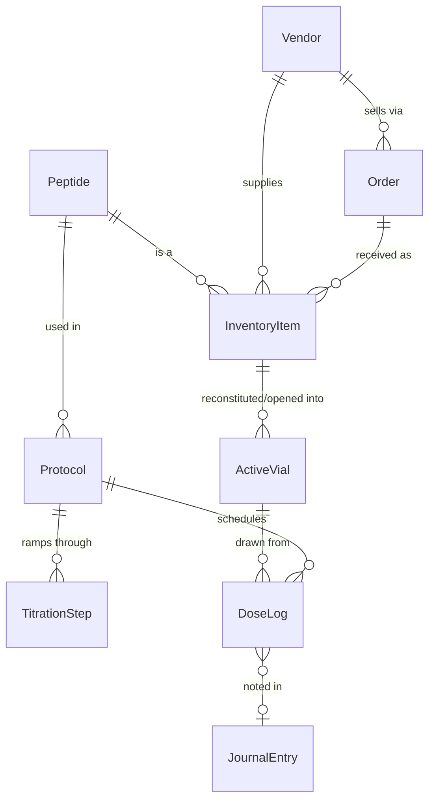

# Amide Roadmap

Where Amide is today, and the path from here to the full feature list in the README.

Each phase is a usable release on its own. Phases are ordered by **data dependency**: later features read records created by earlier ones, so we build the chain from the bottom up — *stock → vials → protocols → doses → everything that analyzes doses*.

---

## Where we are: v0.7 — Inventory + Protocols + Library + Daily Dosing + Dashboard + Vendor Management + Body & Health Tracking (Weight & Measurements + Journal + Labs) ✅

**Vendor Management (v0.6, shipped ahead of schedule)**
- A full `/vendors` page: structured contact/payment methods (built-in types get clickable links,
  custom types are user-addable and reusable), recommend/don't-recommend, per-user favorites,
  sortable list, a price-list attachment with a staleness prompt on reorder, and Purchase History
  scoped the same way every other page in this app is (your own data, plus anyone who's shared
  Inventory with you)
- The New Order flow now asks "new vendor or existing?" up front, and prefills each line's price
  from your own last order with that vendor for the same item — derived from existing order
  history, no separate price list to maintain

**Daily Dosing (v0.4)**
- **Today view** (`/today`): every dose due today, Log (draws the oldest-open Active Vial, deducts the volume, records time) or Skip, with a body-silhouette **injection-site picker** that highlights the last-used site and pulses the recommended mirrored side
- **Missed/late handling:** a day only counts as missed once it's fully passed; a "catch up" list of recent missed doses lives on the Protocol page and logs them as Late
- **Adherence history:** color-coded dots on the Calendar (month/week/day) and a full dose-history table on the Protocol page
- **Peptide pens:** no separate entity — an Active Vial gains a `dispensing_method` flag, set at reconstitution or converted later, with dose-logging wording adjusted accordingly

**Library (v0.3)**
- All 100 peptide cards imported (text + card image) into a searchable Library with goal / "added by me" filters
- Per peptide: your Low/Mid/High dose, frequency, aliases, notes, and goal-stack membership (editable)
- Protocol builder: type-ahead search over the whole library; "View card" per peptide
- `tools/import_cards.py` to re-import an updated PDF; `python -m app.library_load` to reload without it

**Protocols (v0.2)**
- Protocols page: **Active** protocol cards (yellow ribbon), 8 selectable **goal cards**, and **Saved protocols** (scheduled / paused / ended — kept until deleted, with Repeat)
- Goal-driven **builder**: goals → suggested peptide stack (merged across goals) → your dose, unit (mg / mcg / IU), frequency, time of day, route and optional inventory link per peptide
- **Titration** checkbox with weekly steps per peptide; cards show the current step
- Pause / Resume / End / Repeat / Delete; Share button in place (email sharing later)
- Peptide library seeded with the 100 peptide-card names + 5 starters; goal stacks seeded (doses blank for now)
- Read-only JSON API: `/api/protocols`, `/api/peptides`

**Inventory (v0.1)**

- Inventory table: name, count, vial size (mg), medium, lot/batch #, cost, vendor, order / shipped / arrival dates, COA upload (photo/PDF) with lab-measured vial size and purity, notes
- Flags items whose lab-measured amount is more than 10% below the labeled vial size
- **+ Add item** form, edit, delete, COA viewer
- Read-only JSON API (`/api/inventory`) for upcoming features to build on
- SQLite database with migrations, Docker deployment, automated tests

---

## The target data model

This is where the chain is headed. `InventoryItem`, `Peptide`, `Protocol` (with items) and `TitrationStep` exist today.

Key idea: **InventoryItem** is *sealed stock on the shelf* (count = 5 vials). When you reconstitute or open one, it becomes an **ActiveVial** with its own concentration, open date, and remaining amount. Doses are drawn from active vials, which is how Amide will know how much is left and when to reorder.

---

## Phase 1 — v0.2: Inventory foundations

Firm up the base before anything depends on it.

- ✅ *Medium-aware form shipped in v0.7*: amount + unit (mg/mcg/IU), volume for Liquid, units-per-package for Autoinjector/Pill, required fields enforced per medium.
- ✅ *More stock details shipped in v0.7*: expiration date, storage (fridge / freezer / room temp).
- ✅ *Vendors as their own table shipped in v0.7*, as a pick-or-create field on the inventory form (like the peptide picker). A full standalone Vendors management page — edit a vendor's website/contact info, see everything ordered from them — is still Phase 5's *Personal Distributor Contacts*.
- ✅ *Search, sort, filter on the inventory list shipped in v0.7.*
- ✅ *Accounts, legal notice, private data per user and 2FA shipped in v0.4.*
- ✅ *Backup/export (JSON + CSV, additive-only import) shipped in v0.7.*
- ✅ *Settings page shipped in v0.8*: username/password/2FA, email, timezone, colorway, and an admin Manage Users panel, reached from the account menu; Backup & restore now lives there too.
- ✅ *Sharing shipped in v0.9*: per-person, opt-in read-only sharing of Inventory and Personal Data (Protocols), managed from Settings.

## Phase 2 — v0.3: Reconstitution Calculator + Active Vials

- ✅ *Calculator shipped in v0.6*: concentration, draw volume, U-100 units, syringe-fill visual, presets, reverse target-units solver, Inventory/Protocol prefill.
- ✅ *Active Vials shipped in v1.0*: reconstitute from Inventory or the Calculator, tracked concentration/discard-by/doses, expiry-aware Active Vials section with the real vial icon, default discard-window setting.
- **Still open — remaining icon art:** the Calculator's own syringe-fill visual still uses its original CSS-drawn look; the other cropped icons (pens, pill bottle, etc.) remain unused until later phases need them.

- **Calculator:** vial mg + bacteriostatic water mL + desired dose → concentration, **units to draw on a U-100 syringe**, and doses per vial. Syringe size picker (0.3 / 0.5 / 1 mL) with a visual fill line.
- Works standalone, *or* pre-filled by picking an inventory item.
- **"Reconstitute" action:** takes 1 from inventory count → creates an Active Vial with concentration, date mixed, and a discard-by date (configurable, e.g. 28 days).
- Active vial list: remaining mg / doses, days until discard.

## Phase 3 — v0.4: Daily Dosing *(the core loop)* ✅

- ✅ *Protocols and titration steps shipped in v0.2.* Still to add: cycles like 5 on / 2 off, and **titration templates** (common schedules pre-filled when Titration is ticked).
- ✅ *Today view shipped in v0.4*: doses due today, tap to log → picks the oldest-open active vial, deducts the drawn amount, records time and **injection site** (with mirrored-side rotation suggestions via a body-silhouette picker); Skip action logged separately with no vial touched.
- ✅ *Skip / missed / late dose handling and adherence history shipped in v0.4*: missed/late computed lazily (never stored as "missed"), a catch-up affordance on the Protocol page for recent missed doses, and color-coded adherence dots on the Calendar (month/week/day).
- ✅ *Peptide pen tracking shipped in v0.4*: pens are the same Active Vials, flagged via a `dispensing_method` field (no separate pen entity); reconstitution asks whether to load into a pen, and any syringe vial can be converted later.

## Phase 4 — v0.5: Quick View Dashboard ✅

- ✅ *Calendar (month / week / day views of scheduled doses) shipped, now with adherence color-coding since Daily Dosing (v0.4).* Next: tick doses off directly from the calendar (today only the Today view and the Protocol page's catch-up list can log a dose).
- ✅ *Dashboard shipped in v0.5* (spec: `docs/superpowers/specs/2026-09-26-dashboard-design.md`) — the new homepage: a Today's Schedule summary linking out to the real `/today` page, Alerts (low stock — per-item threshold, defaulting to a user-set number; vial/BAC/sealed-stock expiration, both "soon" and already-expired; shipment running long), a Cost snapshot (cost per vial/dose from existing order data), an Adherence snapshot (% on-time/late over the last 30 days, counting genuinely-missed doses against it), and a single-person **viewer switcher** for anyone who's shared data with you (never blended — one person's data at a time, gated per the existing Inventory/Personal-data share categories). This covers the "today's doses," "low stock," "vials nearing discard," and "adherence streak" bullets below.
  - **Deferred out of this build, for later:** per-widget show/hide toggles (shipped as one fixed layout first; toggles are a fast-follow once it's been used for a while); per-vendor historical shipment-time averaging (needs Phase 5's still-open Vendor management page to store it — v1 uses a flat, user-adjustable day-count default instead); the Dashboard's own Weight & Measurements and Journal placeholder cards became real (the Weight/Measurements one still just links out, but the Journal one is now the quick-capture box) once Phase 6 shipped those features; a Health-integration widget stays a **placeholder card only** until Phase 9.
  - **Known follow-up (non-blocking):** the Adherence snapshot slightly over-penalizes a brand-new protocol's very first due day — a not-yet-logged dose due *today* counts against the percentage instead of showing "no data yet" until the day is over (the rest of the app treats a dose as loggable-but-not-yet-missed all day). Cosmetic only, no data-isolation or correctness risk; worth excluding today from the count when convenient.
- ~~Today's doses and what's already done~~ / ~~Low stock~~ / ~~Vials nearing their discard date~~ / ~~Adherence streak~~ — covered by the Dashboard above.
- "Runs out on…" predictions (from protocol usage × inventory) — not part of the Dashboard v1 build; still open.
- Current titration step per protocol on the Dashboard — not part of v1; still open (already visible on the Protocol page itself).
- Subscribe to calendar on device (Apple, Google, Android, etc)
- **Reminders:** browser push notifications and/or [ntfy](https://ntfy.sh) / email
- **Installable phone app (PWA)** so Amide opens from your home screen like a native app

## Phase 5 — v0.6: Orders & Distributor Contacts ✅ (core scope)

- ✅ *Order tracking shipped, ahead of schedule, alongside the v0.7 Inventory work*: multi-item `Order`/`OrderItem` model — order/shipped/arrival dates, tracking site + number, vendor, per-line quantity/cost/lot/expiration/COA, shipping & tax allocated across lines for a true per-vial cost.
- ✅ *Receiving an order creates inventory automatically, shipped alongside the above*: filling in an order's arrival date is the "checked in" action; each line's `received_quantity` (editable down for anything short or damaged) is what counts toward `InventoryItem.available_count`, with COA carried over per line.
- ✅ *Vendors as their own table shipped in v0.7* (see Phase 1) — name, website, notes, pick-or-create from the Order/Inventory forms.
- ✅ *Personal Distributor Contacts (standalone Vendor management) shipped in v0.6* — a full `/vendors` page: structured, extensible contact methods (Email/WhatsApp/Telegram/Phone + user-addable custom types; built-ins render as clickable `mailto:`/`tel:`/`wa.me`/`t.me` links) and payment methods (Credit Card/Cash/Crypto/Alibaba + user-addable), a recommend/don't-recommend flag (the "rating field" from the older wishlist line, kept simple per an explicit decision), a per-user **Favorite** that pins to the top of the list, sortable alphabetically or by most-recent-*visible*-order-date, a reference price-list attachment (file — now including `.doc`/`.docx` — or a URL) with a "still current?" staleness prompt shown when starting a new order from that vendor, and a **Purchase History** on each vendor's page scoped like every other page in this app (your own orders, plus anyone who's shared their Inventory with you — never a global cross-user view). The New Order flow itself now asks "is this a new vendor?" up front: yes gives blank fields for a full profile entered inline; no gives a dropdown of every existing vendor and prefills each line's price from the last time you (or someone who's shared with you) ordered that same item from that same vendor — no separate price list to maintain, it's derived straight from order history.
  - **Known follow-up (non-blocking, narrow):** editing a vendor's other fields (name, notes, etc.) through the edit form can incorrectly bump a URL-based price list's "last verified" date even when the URL itself wasn't touched, because the form pre-fills the field with its current value and the save path doesn't compare against what was there before. Doesn't affect file-based price lists or the order-flow's own staleness check; just means the edit-page date can occasionally look fresher than it really is. Small, well-understood fix (compare the posted value against what was already stored, only bump the date when it actually changed).
- **Cost analytics:** cost per mg, cost per dose, monthly spend per peptide — not started (a different, peptide-scoped slice of this phase; out of scope for the Vendor page above).

## Phase 6 — v0.7: Body & Health Tracking

- ✅ *Weight & Measurements shipped* (spec: `docs/superpowers/specs/2026-09-28-weight-measurements-design.md`) — scale weight, blood pressure, and 7 tape-measure points (neck, biceps L/R, forearms L/R, waist, hips, quads L/R, calves L/R) logged per session, all fields optional; a body silhouette showing each measurement's current value and change since the last time that field was logged (bilateral fields shown as their average, missing sides never silently averaged with zero); a Macros/TDEE calculator (Mifflin-St Jeor + activity multiplier + goal offset, with a safe-floor clamp and visible adjusted-notice) reading a new Settings body-profile section (sex, birth date, height, activity level, goal, diet preset); a water-intake goal (half bodyweight in oz, editable) broken down into cups/bottles-per-hour pacing; BMI and US Navy-method body-fat % computed at read time; hand-drawn SVG trend charts with a 7-day-to-lifetime range selector; sharing via the existing Personal Data category.
  - **Follow-up shipped:** the body silhouette's outline is now a real content-trace of user-provided reference art (male/female front-view outlines), not a hand-drawn blob — each measurement point sits on its real anatomical location with a leader line to its value/delta label, replacing the old disconnected plain-text list.
  - **Deferred out of this build:** actual water-intake logging (this build only computes and displays the goal/pace); metric units; protein/fiber targets and logging (folded into a future pass if wanted); mood/energy/sleep trend charts (see Journal below — text-only journal for now).
- ✅ *Journal shipped* (spec: `docs/superpowers/specs/2026-09-28-journal-design.md`) — daily entries (mood/energy/sleep, each 1-5; a 10-item side-effect checklist plus free-text "other"; a free-text notes field), one entry per day with same-day resubmission editing in place (never a duplicate); a Dashboard quick-capture box for timestamped notes through the day, auto-creating that day's entry and folding in underneath the main entry when later viewed or edited; a read-only, query-time view of that day's logged doses (no stored relationship) so you can see what you took alongside how you felt; sharing via the existing Personal Data category, same as Weight & Measurements.
  - **Deferred out of this build:** mood/energy/sleep trend charts (a plain reverse-chronological list for now); back-dating or editing a past day's entry; a user-extensible side-effect list.
- ✅ *Labs & Medical Results shipped* (spec: `docs/superpowers/specs/2026-09-28-labs-design.md`) — the third and final Phase 6 sub-project. Bulk entry of blood-marker results per panel/draw: a 31-item curated marker dropdown (hormonal/metabolic/lipid/thyroid/liver-kidney/CBC/other) plus a user-addable "Other" marker, a repeatable-row form for entering several results in one sitting, each with its own user-entered reference range (ranges vary by lab, so none is built-in) and an "out of range" flag computed at display time only when both bounds are present; an optional PDF/image report attachment per panel, reusing the existing COA-upload convention (content-sniffed, not just filename-trusted); per-marker hand-drawn SVG trend charts (own panels only, never mixed with a sharing partner's) with the same 7-day-to-lifetime range selector as Weight & Measurements, plus a shaded reference-range band when every point in that chart has one; a read-only, query-time view of which protocol(s)/doses were active on each panel's own draw date (reusing Journal's `doses_for` helper); sharing via the existing Personal Data category. Completes the Labs tab, the last placeholder on the Weight & Measurements page — **Phase 6 is now fully shipped.**
  - **Known follow-up (non-blocking, cosmetic):** an over-length `unit` value is correctly rejected server-side (422) but only shows the form's generic error banner rather than an inline per-field message, since the dialog's error-reopen JS wasn't wired up for that one specific field. Small, well-understood fix.

## Phase 7 — v0.8: Exercise

- ✅ *Exercise shipped* (spec: `docs/superpowers/specs/2026-09-29-exercise-phase7-design.md`) — Workout Plans built either manually or imported from a Muscle & Strength PDF (best-effort parsing that never rejects an upload, even an unreadable file — worst case, a 0-day plan you fill in by hand); a shared review/edit screen where days and exercises can be added, removed, and edited in place, reconciled by row id on save so an unrelated edit (fixing a typo, renaming the plan) never wipes a day's schedule or its logged history; weekday scheduling via checkboxes; exactly one Active plan at a time (activating a new one ends whichever was Active); completion logging per exercise (checked, weight, reps) from any day at any time, pre-filling from an existing log when re-opening an already-logged date; due workouts surfaced on Today (clearing once logged) and a plain marker on the Calendar month view; completed workouts folded into the Journal tab alongside that day's doses; a standalone Fitness Test (Max Push-ups/Sit-ups/Bodyweight Squats, Plank Hold) retakeable anytime with a per-exercise trend chart and an independent 28-day retest suggestion per exercise.
  - **Deferred out of this build:** a calorie-per-rep dataset (explicitly out of scope, noted in the spec as a future idea); a 7-day-to-lifetime range selector on the Fitness Test charts (they show the lifetime trend only); metric weight units beyond lb/kg toggle already built.
  - **Known follow-ups (non-blocking):** no delete/end-plan route yet (a plan can be deactivated but not removed, and uploaded PDFs aren't cleaned up from disk); logged weight/reps are write-only today — no page displays them back yet, only completion counts; logging a workout from the plan editor's own "Log" link redirects to Today rather than back to the editor; the plan editor and its Schedule form are still two separate forms, so a day added in the editor doesn't appear under Schedule until the editor is saved first.

- ✅ **Workout calories, TDEE and progress charts (built 2026-10-06)** (spec: `docs/superpowers/specs/2026-10-06-workout-calories-tdee-design.md`; plan: `docs/superpowers/plans/2026-10-06-workout-calories-tdee.md`) — every logged exercise gets an estimated calorie burn from the owner's exercise workbook (230 exercises, aliases, style profiles and the 2024 Compendium of Physical Activities, shipped as `app/workouts/exercise_data.json`, regenerated by `tools/build_exercise_data.py`). The Journal tab has a **Log Workout** button; a logged workout shows in that day's Journal with its estimated kcal, and a day with a workout but no entry gets its own row. Plan exercises are matched to the database by fuzzy logic (confident matches are applied, weak ones are suggestions a person confirms on the plan editor); exercises can also be added on the day. The log form takes **exact** sets and reps (never a range) plus body weight (from the latest weigh-in, editable); walking, jogging and running take speed or incline and use the Compendium's own MET rows. **History survives plan changes:** logs keep a snapshot of everything their estimate used, and removing a plan day or exercise no longer deletes what was logged; the form offers last time's numbers when the same exercise appears in a later plan. A new **Energy** tab (Workouts) reproduces tdeecalculator.org (four BMR formulas, the BMR/activity/food-digestion split, goal ladder, macro grid, TDEE by activity level, life-stage adjustments) and charts each day's estimated workout burn stacked on the TDEE baseline against the goal target; a **Progress** tab charts per-exercise top load and volume, weekly volume by body area, burn by equipment, the top burners and personal records. Rules worth remembering: **every MET is a Compendium number** (reworked 2026-10-06): each exercise carries its Compendium code and MET (`tools/compendium_data.json`, read from pacompendium.com, is the source; the workbook supplies exercises, aliases, seconds per rep and rest), a rep-based row can be switched to another resistance category on the log form, and treadmill walking/jogging/running, incline walking, stationary bikes and rowing (by watts) and the elliptical and ski ergometer (by effort) use the Compendium's own tables; the Compendium has no per-lift values, so lifts use its resistance-training categories and are labeled "mapped estimate"; calorie numbers are estimates and labeled so; per-row input limits: sets 1-50, reps 1-200, implements 1-9, minutes up to 600, watts up to 2000.
  - **Known differences from the reference calculator:** it labels PCOS "-6% BMR" but applies no change, Amide applies the rule it states; its "max fat metabolism" row is shown as unavailable; fat mass and waist-to-height fill in only when tape measurements exist.
  - **Follow-ups:** a TDEE history that follows weight changes over time (the chart uses the latest weight for every day); an xlsx export of the workout log in the workbook's layout; workouts with no plan day (free-form).

- ✅ **Encrypted backup, export, share and restore (built 2026-10-06)** (spec: `docs/superpowers/specs/2026-10-06-backup-restore-design.md`; plan: `docs/superpowers/plans/2026-10-06-backup-restore.md`) — Settings → Backup & restore has three tabs. **Back up** makes an encrypted `.amidebackup` file (AES-256-GCM, scrypt passphrase, at least 8 characters, no recovery) of chosen sections, always a new dated file; the administrator can also back up the whole installation (every account, vendors, price lists, library and all uploaded files). **Export / Share:** an Export carries chosen sections to a new computer; a Share file offers only Vendors, Price lists, Library, Inventory, Workouts and Protocols and strips personal records (dose logs, workout logs and fitness tests, sales and vials in use, wallets, accounts, profile, measurements, journal, labs). **Restore / Import:** open a file with its passphrase, see what is inside, then load sections each as **Add** (keep what is there, skip duplicates) or **Replace** (the preview says how many current rows would be deleted); links to things outside the loaded sections are found again by name, and unresolved ones are reported. Shared sections load only for the administrator and only as a merge by name. **Restore everything** (administrator, whole-installation file) saves a safety backup in `data/backups` first (newest three kept), needs the typed word RESTORE, runs in one transaction and signs everyone out. Attached files (COAs, lab reports, workout PDFs, wallet QR images, vendor price-list files, library cards) travel with their sections. Settings: `AMIDE_MAX_BACKUP_MB` (default 512). The older plain JSON export/import and inventory CSV remain under "Older formats". Known limits: the file is built in memory; scheduled backups and cloud destinations are not built; a backup from a newer Amide is refused.

- ✅ **Body photos (built 2026-10-06)** (spec: `docs/superpowers/specs/2026-10-06-body-photos-design.md`; plan: `docs/superpowers/plans/2026-10-06-body-photos.md`) — a private **Body photos** section on Weight & Measurements (with an Add body photo link in the Journal tab). Photos are blurred **on the server** until revealed (click, or an authenticator code when the new **Body Recomp Photo 2FA** setting is on: a correct code clears the blur for 10 minutes, per browser session, and ends on logout, Lock now or expiry). The setting reuses the account's 2FA, needs a code to turn off, blocks removing account 2FA while on, and turns itself off if an administrator or the command line resets 2FA. Uploads lose GPS/camera metadata, iPhone HEIC is converted, large photos are shrunk to 2000 px. Only the owner can fetch a photo (everyone else, including the administrator and people you share with, gets 404). Photos are in your own backup and Export, never in a Share file, and their files are removed with the photo or the account. Not built: editing a photo's date or label (delete and re-add), comparison views, a separate photo-only authenticator.

- ✅ **Food tracking, part A: core (built 2026-10-06)** (spec: `docs/superpowers/specs/2026-10-06-food-tracking-design.md`; plan: `docs/superpowers/plans/2026-10-06-food-tracking.md`) — the **Food** tab replaces the Macros tab on Weight & Measurements (`?tab=macros` redirects). Pick a **diet type** (Balanced, High protein, Low carb, Keto, Custom) and a **goal**; the tab shows the day's **calorie limit** (TDEE plus the goal offset, with the safe-floor notice), eaten and remaining, the **potential deficit** (TDEE + logged workout burn - eaten, with an estimated pounds per week and a surplus when it is negative), a **macro pie chart** for the chosen diet type, and **fulfilment bars** for calories, protein, carbs, fat and fiber (fiber target about 14 g per 1,000 kcal). Log food in four meals: find a food, create one, or quick-add; edit servings; delete. **My foods** are private; a built-in **starter list** of about 280 simple everyday foods (USDA SR Legacy, public domain, built by `tools/build_starter_foods.py`) is read-only and can be copied into My foods. Every entry stores a **snapshot** of its numbers, so editing or deleting a food never changes history. One calorie number: the Food tab uses the Energy tab's TDEE (the tdeecalculator.org clone), so the old Macros calculation, which differed slightly, is gone. Food is in the owner's own backup and Export, never in a Share file, and is removed with the account. **Not built yet:** part B (live USDA search, needs a free API key and internet) and part C (meal plans built from simple foods, a library of ready-made diet plans, and GLP-1 / Retatrutide shot-day eating guidance written in original words, with the owner's three reference pages linked rather than copied).
- ✅ **Price list ingest, part A: the engine inside Amide (built 2026-10-06)** (spec: `docs/superpowers/specs/2026-10-06-price-list-ingest-design.md`; plan: `docs/superpowers/plans/2026-10-06-price-list-ingest.md`) — a token-protected intake (`/api/ingest/...`, administrator-created tokens shown once and stored as hashes, 60 requests a minute, size and count caps) takes price lists posted in chat groups: PDFs (text and scanned), photos (one list over several photos), spreadsheets and typed prices. The file naming convention is no longer needed: the **vendor** comes from the group's mapping, the **warehouse** from the list text, then caption or filename words, then the group's default (else China, flagged), and the **date** from the text when within 45 days of the message. A list that is confident (at least 5 rows, 80% priced, warehouse not assumed, not older than the current list, prices within 0.5x to 2x of the current list, not a duplicate) imports by itself and can be **undone**; anything else waits in the **Price list inbox** (Settings, Admin) where the administrator edits vendor, warehouse and date, approves, rejects or downloads the original. The dashboard gets two alerts: "<VENDOR> released new price list." (everyone, dismissable, gone after 7 days) and "<VENDOR> Telegram group is no longer active." (administrator only). The inbox is in the installation backup; tokens are not. **Not built yet:** part B, the watcher program on the owner's computer that logs in to Telegram and calls this API (own spec).

## Phase 8 — v0.9: Peptide Library & Learning

- ✅ *Card import, Library screens and owner-editable doses/goal stacks shipped in v0.3.* Still to add: Peptide Learning (saved articles/notes per peptide), reordering peptides within a goal stack.

- **Library:** a reference entry per peptide (aliases, common vial sizes, storage, typical reconstitution, half-life, notes, sources). Starts from a small seed file you can extend; inventory and protocols link to it.
- **Learning:** personal notes, saved articles and studies, tagged by peptide.
- Needs care on **sourcing and legal wording**. Everything framed as reference, never as dosing advice (consistent with the README's legal notice).

## Phase 9 — v1.0: Integrations & Polish

- **Health trackers.** How realistic each one is:
  - *Apple Health* has no web API. Realistic options: import Apple Health's `export.zip`, or an **iOS Shortcut** that posts data to Amide's API. (Possibly https://www.healthyapps.dev/  or some sort of Webhooks app?)
  - *Google Health Connect* is on-device only (same approach: companion Shortcut/app or file import).
  - *Withings, Fitbit, Oura, Hume*: check each for an available cloud API; OAuth connectors where possible.
  - *Renpho Smart Scales* (added 2026-10-03): feed weight, body fat %, and BMI into the Measurements page automatically. Renpho's app is cloud-based and no official public API is known (verify before building). Candidate routes, safest first: (1) rely on the Renpho app's own sync to Apple Health / Health Connect and reuse the Shortcut or export-import path above; (2) import a CSV export from the Renpho app; (3) an unofficial cloud API, which would need the user's Renpho login and could break without notice.
  - Requires **personal API tokens** in Amide.
- **Vendor price lists and the price analyzer.** *Import built 2026-10-05:* `tools/import_price_lists.py` reads price-list PDFs (vendor, optional warehouse and date come from the filename `<Vendor> - [<Warehouse> ]Price List - <date>`), creates the vendor, and stores every product line: code, product, vial size, pack size, pack price, and whether it is a **kit** (exactly 10 vials) or a **box** (fewer), plus extra price tiers and the vendor's shipping wording. A list that names no warehouse is assumed to be China (recorded as assumed). Price history is kept; the newest-dated list per vendor is current the moment it is imported. Amide stores only the parsed data, never the PDFs. **Vendors and price lists are held only in the local database and are never put in the repository (legal).** *Surfaces built 2026-10-06:*
  - ✅ **Vendor-card price chart (built 2026-10-06):** the vendor page's "Price History" card has a drop-down of every product the vendor lists and charts the price per kit or box over time, one colored line per vial size (the same size keeps its color on every product; a vendor with China and USA lists gets a dashed USA line); hover a point for the per-vial price.
  - ✅ **Library-card price range (built 2026-10-06):** each library card shows a per-vial price range (for its most commonly listed vial size, across the current lists, e.g. `10mg · $5.50 – $12.00 per vial · 7 lists`) at the far right end of the Half-life row.
  - Design: `docs/superpowers/specs/2026-10-06-price-analysis-surfaces-design.md`; plan: `docs/superpowers/plans/2026-10-06-price-analysis-surfaces.md`.
  - **Naming rule (owner):** `W/` means *with* and `W/O` means *without* (so `W/DAC` is with DAC, `W/O DAC` is without DAC); a vendor whose name differs from another only by "Peptide" versus "Peptides" is the same vendor.
  - ✅ **Dashboard "NEW PEPTIDE ALERT" (built 2026-10-06):** `NEW PEPTIDE ALERT <peptide> — <vendor or vendors>` for each product in a current price list that matches no library card (mg / mcg / IU products only). Adding a card or an alias clears it; an administrator can Ignore a product that is not a peptide. The first five show, the rest sit under "Show N more".
  - ✅ **Upload on the vendor page + OCR (built 2026-10-06):** saving a vendor with a price-list PDF reads and imports its prices (warehouse: detect from the file, China if it says nothing, or chosen; date defaults to today) and shows a summary on the vendor page; the importer no longer depends on the filename for this path. A PDF that is only a picture (a scan) is read by RapidOCR (`app/library/price_lists/ocr.py`, packages pinned in `requirements.txt`, models bundled so it works offline): words with positions are rebuilt into a table by their place on the page and read by the normal reader. Tables headed "price / kit" with bare doses are read too.
  - Not yet read: standalone image price lists (JPG/PNG, only PDFs go through OCR) and spreadsheets. The Docker image gained two system libraries for OCR and has not been built here.
  - *First import, 2026-10-05:* 11 price lists, 1,313 product lines (1,096 matched to a library card; 1,292 kits, 6 boxes, 15 with no pack size stated), 9 vendors created and 1 existing vendor reused. 7 of the 11 lists named no warehouse and were recorded as an assumed China. One scanned PDF, 6 image lists and 1 spreadsheet were skipped. 117 distinct products matched no library card (liquids, blends and a few peptides): these are the candidates the new-peptide alert will surface.
- Charts correlating any metric against doses/protocols
- Multi-user / household support (if wanted)
- Themes, accessibility pass, full documentation

---

## Phase 10 — v1.1: Beautification (all specific items shipped; one open-ended item deferred)

A dedicated visual-polish pass, pulled together from items across the owner's 2026-09-29 wishlist that are about *how things look* rather than new capability. Every concretely-scoped item below is done; only the vague "General" catch-all at the bottom remains, deliberately deferred until there's a specific page/pain-point to point at.

- ✅ *Dashboard shipped, 2026-09-30* — every widget (Schedule, Alerts, Cost snapshot, Adherence, Water goal, Journal, both placeholders) now renders as its own `.card` panel in a responsive grid instead of stacking as plain full-width sections; each panel gets a colored accent stripe + line-icon in its header, Adherence/Water goal show their number as a big stat, and each panel's title links through to its own page.
  - *Prerequisite fixed 2026-09-30 (found while fixing the Charts item's own dull rendering):* `.card`/`.dashboard-placeholders`/`.measurement-chart` had zero CSS anywhere -- every chart across Measurements, Labs, Fitness Test, and this Dashboard was a bare, unstyled `<h3>` + SVG on the page background. `.card` now has a real surface/border/shadow and chart lines use `--accent` instead of the plain text color.
- ✅ *Dashboard "pop" pass shipped, 2026-09-30* — a real water-intake log (`water_logs` table) backs the Water goal panel: a "+ Log water" popup (three quick-pick amounts plus a custom field) and the panel's own background now fills like a glass toward the day's goal. A new "Body" panel puts the Measurements page's Weight chart and Body Silhouette on the Dashboard (fixed to the default range/metric, not the interactive picker). A "Workouts this week" panel shows a Mon-Sun strip (rest/upcoming/done/missed per day, today ringed) instead of a "due today" item that would vanish the moment an early workout got logged. The whole grid was then rebuilt as an explicit named-area layout, per the owner's own exact arrangement (Schedule/Alerts, Workouts/Adherence, Water/Cost, and Journal/Weight each paired left-right around a big centered, enlarged Body card, Integrations dropped to its own low-key row at the bottom) — catching and fixing a page-wide CSS rule (`section + section` margin) that had been silently throwing the pairs' alignment off.
- ✅ *Library shipped, 2026-09-30* — the dosage-tier badge (Beginner/Intermediate/Advanced) gets a colored dot + text (green/yellow/red via the `--tier-*` tokens), and Side Effects/Contraindications/Drug Interactions each get a colored left border + tinted heading — *the dosing-tier coloring was originally flagged during the peptide-sheet-import spec as "for the Library Redesign phase," which shipped without it; this is that dropped item, landed a little earlier than the rest of Phase 10 and confirmed still correct here*
- ✅ *Calendar shipped, 2026-09-30* — status (On time/Late/Missed/Upcoming) is now the dominant color everywhere instead of a small dot: Month's day marks are full colored bars, Week's marks are colored banners, Day's cards get a colored left-edge accent, and the click-through dialog's top edge matches the clicked occurrence's status. A shared legend sits above all three views. Protocol identity (previously the mark's background color) now comes from the initials/name text already shown, since status took over the bar/banner/edge itself.
  - ✅ *Site-picker art replaced, 2026-09-30* — the injection-site picker's own hand-coded "blob" path is gone; it now reuses the same traced, sex-aware body outline (`_silhouette_shape()`) as the Measurements page, with the 8 site dots repositioned onto the real figure.
- ✅ *Overview chart shipped, 2026-09-30* — a single chart driven by a metric dropdown (every measurement field, BMI, Body fat %, Blood pressure, plus new Heart Rate tracking) sits beside the Body silhouette at the top of the Measurements page, switching client-side with no round-trip; the existing 7-day-to-lifetime range selector now drives it too. The full grid of every metric's own small chart stays below, unchanged, for at-a-glance scanning.
- ✅ *Body silhouette interactivity shipped, 2026-09-30* — all 7 labels moved to one right-hand column; hovering a point shows a custom tooltip with the last two measurements and the delta; clicking jumps the Overview chart to that body part's history (a new averaged "<Location> (avg)" option for the 4 bilateral locations, so an averaged point jumps to the same average it's showing, never an arbitrary side).
- ✅ *Inventory shipped, 2026-09-30* — "New order" now matches "+ Add item"'s styling (btn-primary + icon), with the two floating buttons stacked on mobile instead of overlapping.
- ✅ *Body Outline entry forms shipped, 2026-09-30* — measurement fields now sit label-beside-input with a narrower box (scoped to this one form, not the app-wide field style); the day-range control is a real dropdown on both the Measurements and Labs sub-tabs.
- **Workouts page button spacing (open, 2026-10-03):** the gap between the "Choose File" control and the Upload button on the Import-a-PDF form is too wide (the native file input's "No file chosen" text takes the space). Layout is currently inline-styled flexbox; replace with a proper CSS class and tighten that gap.
- **Library caution-tape rounded corners (open, 2026-10-03):** the yellow/black stripe on the left edge of Side Effects / Contraindications / Drug Interactions cards works (`.lib-section-caution`, `border-image`), but `border-image` ignores `border-radius`, so the stripe has square corners against the card's rounded ones. Find a way to round them (e.g. mask/clip-path or a layered gradient instead of `border-image`).
- **General (deferred, 2026-09-30):** a color/accent pass across the app, tighter visual grouping — the owner's own "overall beautification" note. Left open on purpose: every other Phase 10 item named a specific page/feature to fix; this one didn't, so it's parked until there's a concrete target instead of a vague pass.

---

## Cross-cutting work (ongoing, alongside the phases)

| Area | Plan |
| --- | --- |
| **CI** | GitHub Actions: run tests on every push; build and publish Docker image to GitHub Container Registry on tags |
| **Releases** | Semantic versions (`v0.2.0`…), changelog, migrations always forward-compatible |
| **Backups** | Scheduled automatic backup of `data/` (Phase 1), restore tested in CI |
| **Security** | Accounts + 2FA + lockout + cross-site form protection (done, v0.4), upload validation (done); raise the minimum password length; guidance for reverse proxy + HTTPS |
| **Data ownership** | Full export at any time in open formats (JSON/CSV); no telemetry, no external calls unless you enable an integration |

---

## Requested enhancements (owner's To Do list, 2026-09-29)

Raw wishlist items, organized by app area to match the source list. Not yet spec'd — these are candidates for future brainstorming/spec/plan cycles, not committed scope.

**Dashboard**
- ✅ *Each card clickable through to its page, shipped 2026-09-30 — see Phase 10*
- *(Grafana-style visual rework and layout pass moved to Phase 10 — Beautification)*

**Inventory**
- New-item "Local Seller" checkbox — excludes shipping-time math for that item
- Sort Peptides/Medicines by Expiration, then FIFO by Arrived Date (oldest stock first)
- BAC Water: vial size (mL), COA upload, and the ability to convert an opened BAC Water bottle into an Active Vial *(builds on Active Vials, Phase 2 ✅)*
- All Active Vials assumed refrigerator-stored once made active, 28-day clock starts on reconstitution; a "Put These Dates on Your Labels" popup (recon date + 28-day expiry) at reconstitution time *(extends the existing reconstitution flow, Phase 2 ✅)*
- On order check-in, offer to print vial labels (name, concentration, batch, blank recon/exp date boxes, "Research Use Only")

**Vendors**
- Average shipping time on the vendor card — *its own blocking dependency (Phase 5's Vendor management page) has since shipped in v0.6; this is now buildable*
- Add/remove a vendor card from the list

**Protocols**
- Vitamins/Supplements card and Prescriptions card (non-peptide); future conflict-checking between meds and peptides
- Multi-goal selection for a single protocol
- Frequency: day-of-week picker for non-daily schedules, "X times per day," "X times per week"
- **Expanded Time of Day options** (parked during the Phase 10 Calendar redesign brainstorm, 2026-09-30, so it isn't missed — this is a real data-model change to the dosing/protocol Time of Day concept, not a cosmetic tweak, and deserves its own brainstorm/spec cycle before implementation): Fasting, Waking (immediately after waking), AM (first half of day), Pre-Workout (up to 1hr before), Post-Workout (up to 1hr after), PM (second half of day), Before Bed (up to 1hr before), Bedtime, Any. Slots collapse from the bottom up when unused — e.g. no Waking entries means AM takes the first position; no Before Bed/Bedtime entries means Any moves up rather than leaving a gap.
- Pre-planned stacks: Top 10 Stacks PDF, "Celebrity Stacks" — *note: overlaps with Library's "26 or so Premade Protocols" below, same underlying content*
- Printable protocol view
- **"How many vials do I need?" calculator**, on the protocol-item level — given a protocol's dose/frequency/duration, work out how many vials to order from a vendor. Brainstormed and spec'd 2026-09-30; split into two sub-projects since the calculator needs a correct day-by-day schedule to total against first:
  - ✅ *Cycle On/Off shipped, 2026-09-30* (spec: `docs/superpowers/specs/2026-09-30-protocol-cycle-on-off-design.md`) — a protocol item can now have one or more "cycle off" week-ranges (e.g. 3-weeks-on/3-weeks-off) during which it's never due, on Today/Calendar/Dashboard alike, regardless of frequency or titration; a "+ Cycle off" control in the builder, independent of the Titration toggle. A whole-branch review caught the builder flow not actually working end-to-end for the single most common titration shape (a ramp step then an open-ended "onward" step) — fixed by allowing a cycle-off to overlap a titration step (`is_due()` already makes the cycle-off win either way) and simplifying a broken toggle button down to one always-present "+ Cycle off".
  - **Still open:** the totals popup itself (an icon on each saved protocol, any status, showing each item's total course quantity — including BAC water for reconstitution — in its own unit, plus an estimated vial count rounded up) now that the schedule it totals against is correct. Also still open from that same brainstorm: a per-InventoryItem "purchasing unit" (individual vial vs. a 10-vial kit), used to size an "as needed" item's course total.

**Body Outline**
- Labs form: list every marker with an inline entry box instead of select-then-add; an "Add Marker" button for anything not listed; integer-only entries (positive/negative, `<`/`>` accepted, 0 is valid)
- *(Entry-box sizing/placement and day-range dropdown moved to Phase 10 — Beautification)*

**Charts & Graphs**
- *(Body outline label repositioning, hover, and click-through shipped in Phase 10 — Beautification, 2026-09-30)*
- Historical labs backfill
- AI-assisted lab-result interpretation (MedGemma or similar) — *see MedGemma below; this is the same proposal*
- *(Overview chart dropdown + readability shipped in Phase 10 — Beautification, 2026-09-30)*

**Calendar**
- Month view: individual card per day, not one long bar (structural, not just visual)
- Any view: clicking an item due today should surface Pick Site / Log Dose directly
- Subscribe-to-calendar logic — *already an open Phase 4 item ("Subscribe to calendar on device"); no new roadmap entry needed, just reaffirmed*
- *(Legend, color-bar/banner/accent styling, and the site-picker art moved to Phase 10 — Beautification)*

**Calculator**
- Add HGH-specific dosing calculations (reference: peprecon.com/hgh)

**Library**
- Per-peptide "open calculator prefilled with Beginner/Moderate/Advanced/Custom dosing" button
- Find peptides still showing the old card-style entry (High/Moderate/Low evidence tag) and get them onto the sheet-style entry — confirmed two distinct causes, both real:
  1. **31 peptides have a real sheet-style entry that already exists under a slightly different name** (e.g. card "Amylin" vs sheet "Amylin (IAPP)"; card "Atosiban" vs sheet "Atosiban (Tractocile)"), so the import's exact-name match created a second row instead of updating the original — these are the "two entries, same thing" duplicates. A fix belongs in `load_sheets`'s matching logic (e.g. also check aliases), not a data-entry job.
  2. **35 peptides have no matching source file at all yet** (e.g. AMG-133/MariTide, Nafarelin, Epitalon, GLP-1, GIP, and 30 others) — genuinely still card-only, matching "anything with a High/Moderate/Low tag potentially."
- ~26 premade protocols, sourced from the owner's own saved copies of what influencers in the space are running plus community-consensus protocols — *overlaps with Protocols' "Pre-Planned Stacks" above, same source material*
- Standardized footer copy change (Educational/Informational Purposes Only disclaimer wording)
- *(Dosage-tier color bar and caution-style borders moved to Phase 10 — Beautification)*

**Overall**
- *(General visual/color/accent pass — see Phase 10 — Beautification)*

**MedGemma / AI lab interpretation**
- A hybrid architecture proposal: deterministic code for all real calculations (HOMA-IR, LDL, eGFR, dosing conversions, etc.), a self-hostable medical LLM (MedGemma or similar) strictly for *explaining* results and flagging calculation mismatches against a reference database, never for doing the math itself. Includes an AI-acceptance popup/checkbox per upload and a Settings-level on/off toggle. Raises real privacy/PHI-hosting considerations if ever exposed beyond local use.
- *This is architecturally substantial — worth its own brainstorming/spec cycle before it's more than a placeholder line on the roadmap, not something to fold in as a quick bullet.*

---

## Known Limitations

### Library price-list import: vendor naming (resolved 2026-10-05; remaining names are by hand)
Vendors spell one compound many ways ("BPC157", "BPC 157", "Hexarelin Acetate", "Kiss Peptin-10"). `tools/import_price_lists.py` now matches each price-list name to an existing library card in tiers (`app/library/matching.py`), stopping at the first tier with a hit:
1. **exact** name (any case)
2. **normalized**: spacing, punctuation, case and a trailing "Acetate" ignored
3. **related**: the card's Aliases (comma-separated; a slash may sit inside one), or the name without its parenthetical ("Aicar" = "AICAR (Acadesine)")
4. **blend**: the same set of ingredients whatever the doses or order ("BPC157 5mg+TB500 5mg" = "Wolverine Stack (BPC-157 + TB-500)")
5. **fuzzy**: exactly one misspelled word, with the digits and word count identical

Real product differences are never merged: with / without / no / DAC (and anything in a parenthetical containing those words) stay separate, so "with B12" never lands on "without B12" and "CJC-1295 (No DAC)" never on "CJC-1295 DAC". The importer never creates cards and only *adds* specs to a card, so re-importing is safe.

**How to teach it a new spelling:** add the vendor's name to the right card's **Aliases** in the library editor, then re-run the import. A generic card catches its variants this way: the two TRT cards list each testosterone ester (Cypionate, Decanoate, Phenylpropionate, Propionate, Sustanon, Undecanoate) as aliases, since "TRT" is the generic name for any testosterone ester.

**Resolved with the owner's answers (2026-10-05):** `5Amino/MQ`, `Fox04 -DRI` and `SLU332` are aliases on 5-Amino-1MQ, FOXO4-DRI and SLU-PP-332; `CJC1295(Without DAC)5mg+IPA5mg` is the No-DAC CJC-1295 + Ipamorelin product (alias on that card); the GLOW and KLOW blends map to their existing blend cards, and the BPC-157 + TB-500 blends to Wolverine Stack; and cards were created for **Erythropoietin (EPO)**, **Human Menopausal Gonadotropin (HMG)**, **Relaxation PM** (a custom blend; its DSIP / Selank / Oxytocin / Epitalon composition and dose ranges are in the card's Notes) and the five **HGH Fragment 176-191 … 195** products, which are individual products and stay separate cards.

**Still unmatched (5 names; nothing was created for them):** `L-carniting 600mg(Liquid)` (probably the existing L-Carnitine card), `TNT(Testosterone Ethanate+ Trenbolone Ethanate)`, `Tpropionate Isocaproate`, `TB2(BT)`, `THY-1(TA5)`. Add each as an alias of the right card, or create a card, in the Library edit phase. The new cards above are bare (name, specs from the price list, Relaxation PM's notes): their descriptions, "focus" and dosing still need filling in. `KGLOW` has no library card yet.

### Importer-created library cards (cleaned up 2026-10-05)
An early importer created a custom card for every price-list name it couldn't match exactly. The 53 unreferenced ones (ids 220 and 222–274, including the duplicate `HGH 191AA (Somatropin)`) were removed from the local database and the import re-run with the new matcher; backups are `data/amide.db.bak-2026-10-03`, `data/amide.db.bak-2026-10-05` and `data/amide.db.bak-2026-10-05-b`. `B-12` (id 221) was kept because a protocol uses it. Specs for any name still unmatched are not on a card, but they remain in the PDF and attach as soon as a card or alias exists.

### Course Totals: "normally supplied" vial size (done 2026-10-05)
The library card editor now has **Normally supplied vial size** (amount + unit). Total Course Quantities uses it for the vial and BAC water estimate when a protocol item has no linked inventory item. No card has it filled in yet; set it per peptide as needed. (When an inventory item *is* linked, that item's own vial size still wins and must be Lyophilized, as before.)

---

## Open questions (decisions for the owner)

1. **Cost:** is it *total paid for the line* or *price per unit*? (Today it's a single "Cost" field. Per-unit vs. total matters for cost-per-dose math.)
2. **Count on reconstitution:** should reconstituting a vial automatically reduce the inventory count? (Proposed: yes.)
3. **Remote access:** will Amide be reachable only at home, via VPN (e.g. Tailscale), or publicly? This decides how much auth to build in Phase 1.
4. **Users:** just you, or a household/partner with separate logs?
5. **Units:** do any of your items use IU (e.g. HCG, HGH) so Phase 1 must handle IU from day one?
