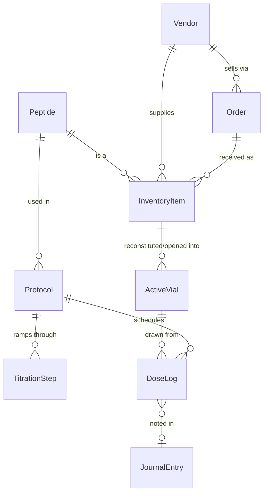

# Amide Roadmap

Where Amide is today, and the path from here to the full feature list in the README.

Each phase is a usable release on its own. Phases are ordered by **data dependency**: later features read records created by earlier ones, so we build the chain from the bottom up — *stock → vials → protocols → doses → everything that analyzes doses*.

---

## Where we are: v0.3 — Inventory + Protocols + Library ✅

**Library (v0.3)**
- All 100 peptide cards imported (text + card image) into a searchable Library with goal / "added by me" filters
- Per peptide: your Low/Mid/High dose, frequency, aliases, notes, and goal-stack membership (editable)
- Protocol builder: type-ahead search over the whole library; "View card" per peptide
- `tools/import_cards.py` to re-import an updated PDF; `python -m app.library_load` to reload without it

**Protocols (v0.2)**
- Protocols page: **Active** protocol cards (yellow ribbon), 8 selectable **goal cards**, and **Saved protocols** (scheduled / paused / ended — kept until deleted, with Repeat)
- Goal-driven **builder**: goals → suggested peptide stack (merged across goals) → your dose, unit (mg / mcg / IU), frequency, time of day, route and optional inventory link per peptide
- **Titration** checkbox with weekly steps per peptide; cards show the current step
- Pause / Resume / End / Repeat / Delete; Share button in place (email sharing later)
- Peptide library seeded with the 100 peptide-card names + 5 starters; goal stacks seeded (doses blank for now)
- Read-only JSON API: `/api/protocols`, `/api/peptides`

**Inventory (v0.1)**

- Inventory table: name, count, vial size (mg), medium, lot/batch #, cost, vendor, order / shipped / arrival dates, COA upload (photo/PDF) with lab-measured vial size and purity, notes
- Flags items whose lab-measured amount is more than 10% below the labeled vial size
- **+ Add item** form, edit, delete, COA viewer
- Read-only JSON API (`/api/inventory`) for upcoming features to build on
- SQLite database with migrations, Docker deployment, automated tests

---

## The target data model

This is where the chain is headed. `InventoryItem`, `Peptide`, `Protocol` (with items) and `TitrationStep` exist today.

Key idea: **InventoryItem** is *sealed stock on the shelf* (count = 5 vials). When you reconstitute or open one, it becomes an **ActiveVial** with its own concentration, open date, and remaining amount. Doses are drawn from active vials, which is how Amide will know how much is left and when to reorder.

---

## Phase 1 — v0.2: Inventory foundations

Firm up the base before anything depends on it.

- ✅ *Medium-aware form shipped in v0.7*: amount + unit (mg/mcg/IU), volume for Liquid, units-per-package for Autoinjector/Pill, required fields enforced per medium.
- ✅ *More stock details shipped in v0.7*: expiration date, storage (fridge / freezer / room temp).
- ✅ *Vendors as their own table shipped in v0.7*, as a pick-or-create field on the inventory form (like the peptide picker). A full standalone Vendors management page — edit a vendor's website/contact info, see everything ordered from them — is still Phase 5's *Personal Distributor Contacts*.
- ✅ *Search, sort, filter on the inventory list shipped in v0.7.*
- ✅ *Accounts, legal notice, private data per user and 2FA shipped in v0.4.*
- ✅ *Backup/export (JSON + CSV, additive-only import) shipped in v0.7.*
- ✅ *Settings page shipped in v0.8*: username/password/2FA, email, timezone, colorway, and an admin Manage Users panel, reached from the account menu; Backup & restore now lives there too.
- **Still open:** Sharing (inventory or full personal data with others on the same network).

## Phase 2 — v0.3: Reconstitution Calculator + Active Vials

- ✅ *Calculator shipped in v0.6*: concentration, draw volume, U-100 units, syringe-fill visual using real U-100 Icons, presets, reverse target-units solver, Inventory/Protocol prefill.
- **Still open — Active Vials:** a "Reconstitute" action that takes 1 from inventory count and creates a tracked mixed vial (using real vial icons with labels, concentration, date mixed, discard-by date, doses remaining). This needs its own decisions (default discard window, what happens to the inventory count, whether reconstituting requires an inventory item to exist first) before it's built.

- **Calculator:** vial mg + bacteriostatic water mL + desired dose → concentration, **units to draw on a U-100 syringe**, and doses per vial. Syringe size picker (0.3 / 0.5 / 1 mL) with a visual fill line.
- Works standalone, *or* pre-filled by picking an inventory item.
- **"Reconstitute" action:** takes 1 from inventory count → creates an Active Vial with concentration, date mixed, and a discard-by date (configurable, e.g. 28 days).
- Active vial list: remaining mg / doses, days until discard.

## Phase 3 — v0.4: Daily Dosing *(the core loop)*

- ✅ *Protocols and titration steps shipped in v0.2.* Still to add: cycles like 5 on / 2 off, and **titration templates** (common schedules pre-filled when Titration is ticked).
- **Today view:** doses due today. Tap to log → picks the active vial, deducts the amount, records time and **injection site** (with site rotation suggestions).
- Skip / missed / late dose handling; adherence history.
- **Peptide pen tracking:** pens are active vials measured in clicks or doses.

## Phase 4 — v0.5: Quick View Dashboard

- ✅ *Calendar (month / week / day views of scheduled doses) shipped.* Next: tick doses off from the calendar once Daily Dosing exists.

- Today's doses and what's already done
- Low stock and "runs out on…" predictions (from protocol usage × inventory)
- Vials nearing their discard date
- Adherence streak, current titration step per protocol
- Subscribe to calendar on device (Apple, Google, Android, etc)
- **Reminders:** browser push notifications and/or [ntfy](https://ntfy.sh) / email
- **Installable phone app (PWA)** so Amide opens from your home screen like a native app

## Phase 5 — v0.6: Orders & Distributor Contacts

- **Vendor contacts:** name, website, contact methods, payment notes, rating, private notes
- **Order tracking:** order date, vendor, line items, shipping/tracking #, status (ordered → shipped → received)
- **Receiving an order creates inventory automatically**, with COA attached
- **Cost analytics:** cost per mg, cost per dose, monthly spend per peptide

## Phase 6 — v0.7: Body & Health Tracking

- **Weight & measurements** (waist, hips, body fat %, etc.) with trend charts
- **Macros:** water, protein, and fiber daily targets and logging
- **Journal:** daily entries: mood, energy, sleep, side effects, free text. Linked to that day's doses, so you can see *what works and what didn't*.
- **Labs & medical results:** upload PDFs, enter values with reference ranges, chart markers over time and overlay against protocols

## Phase 7 — v0.8: Exercise

- Build plans (days → exercises → sets/reps/weight)
- Log workouts, track progression and personal records
- Show workouts alongside dosing and body metrics

## Phase 8 — v0.9: Peptide Library & Learning

- ✅ *Card import, Library screens and owner-editable doses/goal stacks shipped in v0.3.* Still to add: Peptide Learning (saved articles/notes per peptide), reordering peptides within a goal stack.

- **Library:** a reference entry per peptide (aliases, common vial sizes, storage, typical reconstitution, half-life, notes, sources). Starts from a small seed file you can extend; inventory and protocols link to it.
- **Learning:** personal notes, saved articles and studies, tagged by peptide.
- Needs care on **sourcing and legal wording**. Everything framed as reference, never as dosing advice (consistent with the README's legal notice).

## Phase 9 — v1.0: Integrations & Polish

- **Health trackers.** How realistic each one is:
  - *Apple Health* has no web API. Realistic options: import Apple Health's `export.zip`, or an **iOS Shortcut** that posts data to Amide's API.
  - *Google Health Connect* is on-device only (same approach: companion Shortcut/app or file import).
  - *Withings, Fitbit, Oura, Hume*: check each for an available cloud API; OAuth connectors where possible.
  - Requires **personal API tokens** in Amide.
- Charts correlating any metric against doses/protocols
- Multi-user / household support (if wanted)
- Themes, accessibility pass, full documentation

---

## Cross-cutting work (ongoing, alongside the phases)

| Area | Plan |
| --- | --- |
| **CI** | GitHub Actions: run tests on every push; build and publish Docker image to GitHub Container Registry on tags |
| **Releases** | Semantic versions (`v0.2.0`…), changelog, migrations always forward-compatible |
| **Backups** | Scheduled automatic backup of `data/` (Phase 1), restore tested in CI |
| **Security** | Accounts + 2FA + lockout + cross-site form protection (done, v0.4), upload validation (done); raise the minimum password length; guidance for reverse proxy + HTTPS |
| **Data ownership** | Full export at any time in open formats (JSON/CSV); no telemetry, no external calls unless you enable an integration |

---

## Open questions (decisions for the owner)

1. **Cost:** is it *total paid for the line* or *price per unit*? (Today it's a single "Cost" field. Per-unit vs. total matters for cost-per-dose math.)
2. **Count on reconstitution:** should reconstituting a vial automatically reduce the inventory count? (Proposed: yes.)
3. **Remote access:** will Amide be reachable only at home, via VPN (e.g. Tailscale), or publicly? This decides how much auth to build in Phase 1.
4. **Users:** just you, or a household/partner with separate logs?
5. **Units:** do any of your items use IU (e.g. HCG, HGH) so Phase 1 must handle IU from day one?
